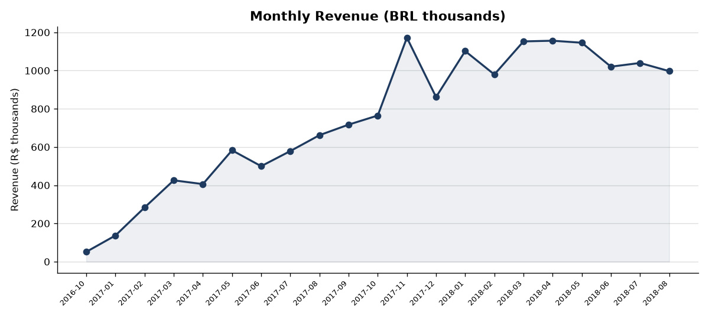
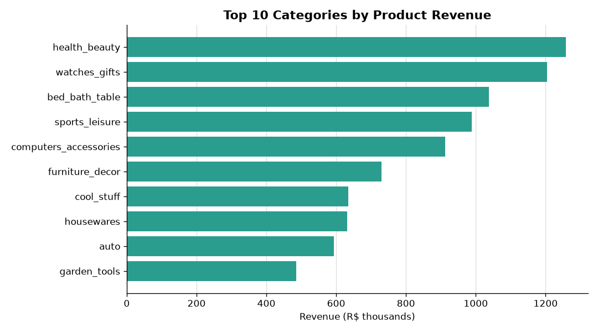
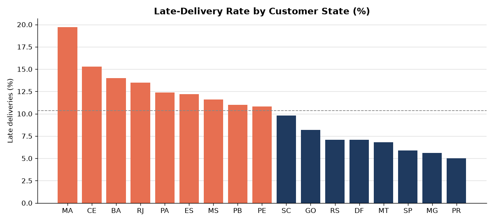
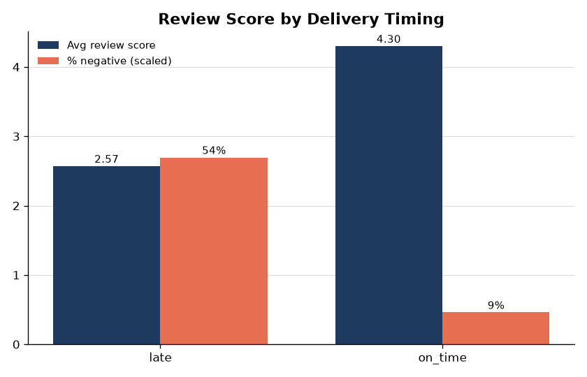
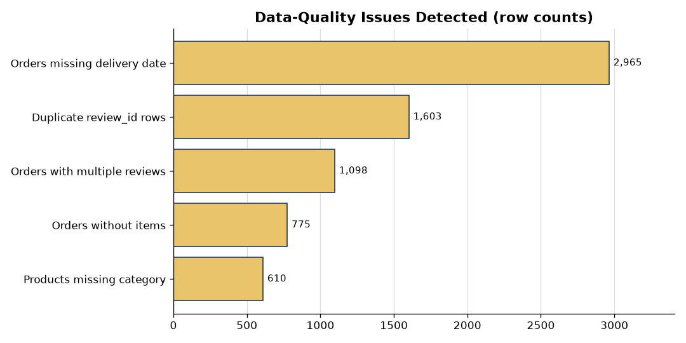

# Olist E-Commerce — SQL & Spreadsheet Analytics

A data-analytics portfolio project built on the **Olist Brazilian E-Commerce
Public Dataset** (~100k real marketplace orders, 2016–2018). The workflow is
deliberately analyst-shaped: load raw CSVs into a relational **SQLite**
database, answer business questions in **SQL**, run a quantified
**data-quality** audit, export **Google-Sheets-ready CSVs**, and chart the
results with **matplotlib**.

No machine learning — this is SQL, spreadsheets, anomaly detection, and
business reporting.

- **Business findings:** [`findings.md`](findings.md)
- **Queries:** [`analysis/`](analysis)
- **Exported result tables:** [`exports/`](exports)
- **Charts:** [`charts/`](charts)

---

## Headline results

| Metric | Value |
| --- | --- |
| Gross merchandise value | **R$15.7M** |
| Orders | **99,441** |
| Unique customers | **96,096** |
| One-time customers | **97.0%** of the base |
| On-time review score vs late | **4.30** vs **2.57** / 5 |
| Late deliveries (national) | **8.1%**, up to **19.7%** in some states |

*(All reproducible from `analysis/00_business_overview.sql`.)*

---

## Setup

Requires Python 3.9+ with `pandas` and `matplotlib` (standard-library
`sqlite3`, `urllib`).

```bash
cd analytics
pip install pandas matplotlib

python scripts/download_data.py      # fetch raw Olist CSVs into data/raw/
python scripts/load_to_sqlite.py     # build data/olist.db from schema.sql
python scripts/run_analysis.py       # run every SQL file, write exports/*.csv
python scripts/make_charts.py        # render charts/*.png from the exports
```

The database (`data/olist.db`) and raw CSVs (`data/raw/`) are regenerated by
the scripts and are not committed. The exported result tables and charts are
committed so the findings can be reviewed without running anything.

---

## Schema

Eight related tables (primary keys, foreign keys and indexes defined in
[`schema.sql`](schema.sql)). The `orders` fact table links customers to the
items, payments and reviews of each order; `order_items` links to the product
and seller catalogs.

```
              +------------------------+
              |   category_translation |
              |  category_name (PK)    |
              +-----------+------------+
                          | 1
                          |
                          | *
+---------------+   +-----v-------+        +--------------+
|   customers   |   |  products   |        |   sellers    |
| customer_id PK|   | product_id PK|       | seller_id PK |
+------+--------+   +------+------+        +------+-------+
       | 1                 | 1                   | 1
       |                   |                     |
       | *                 | *                   | *
+------v--------+   +-------v---------------------v---+
|    orders     | 1 |          order_items           |
| order_id  PK  +--<| (order_id, order_item_id) PK   |
| customer_id FK|  *| product_id FK, seller_id FK    |
+---+-------+---+   +-------------------------------+
    | 1     | 1
    |       |
    | *     | *
+---v----+ +v--------------+
| order_ | | order_reviews |
| payments| | review_id    |
| (order_id,| | order_id FK |
|  seq) PK  | +-------------+
| order_id FK|
+-----------+
```

| Table | Grain | Rows |
| --- | --- | --- |
| `customers` | one row per order-customer | 99,441 |
| `sellers` | one row per seller | 3,095 |
| `products` | one row per product | 32,951 |
| `category_translation` | category name → English | 73 |
| `orders` | one row per order | 99,441 |
| `order_items` | one row per item within an order | 112,650 |
| `order_payments` | one row per payment on an order | 103,886 |
| `order_reviews` | one row per review | 99,224 |

---

## Analysis queries

Each file is a single SQL statement whose result is exported to
`exports/<name>.csv`.

| File | Business question | SQL techniques |
| --- | --- | --- |
| `00_business_overview.sql` | Top-line KPIs | subqueries, CTEs, aggregation |
| `01_monthly_revenue_growth.sql` | How did revenue trend month over month? | CTE, date aggregation, `LAG` window |
| `02_top_categories_by_revenue.sql` | Which categories drive revenue? | multi-table `JOIN`, `RANK` window |
| `03_top_seller_per_state.sql` | Who is the top seller in each state? | `RANK` partitioned window, `JOIN` |
| `04_delivery_performance_by_state.sql` | Where are deliveries slow/late? | `JOIN`, `GROUP BY … HAVING`, date math |
| `05_payment_type_mix.sql` | How do customers pay? | `GROUP BY`, subqueries for share-of-total |
| `06_review_score_vs_delivery.sql` | Do late deliveries hurt reviews? | CTE, `JOIN`, `CASE`, date comparison |
| `07_repeat_vs_onetime_customers.sql` | Repeat vs one-time value? | CTE, `GROUP BY … HAVING`, subqueries |
| `08_category_momentum_qoq.sql` | Category growth quarter over quarter? | CTEs, `LAG` + `RANK` windows, date aggregation |

### Data-quality audit (`analysis/quality/`)

| File | Checks |
| --- | --- |
| `q1_duplicate_records.sql` | Duplicate review IDs, multi-review orders, full-row duplicates |
| `q2_null_patterns.sql` | Null rates on key columns + status/date contradictions |
| `q3_outlier_values.sql` | Values beyond mean + 3σ for price, freight, weight |
| `q4_referential_integrity.sql` | Orphaned orders/items/payments and broken foreign keys |

---

## Charts

**Monthly revenue** — ~20x growth through 2017, then a 2018 plateau.



**Top categories** — the top 10 categories drive 62% of product revenue.



**Late-delivery rate by state** — a regional problem, from 5% to nearly 20%.



**Reviews vs delivery timing** — late orders average 2.57★ vs 4.30★ on time.



**Data-quality issues** — quantified before trusting any headline number.



---

## Google Sheets

Every file in `exports/` is UTF-8, comma-delimited with a header row and no
index column — ready for **File → Import** (or drag-and-drop) into Google
Sheets. The result tables are small (2–50 rows each) and built for pivoting.

---

## Data source

Olist Brazilian E-Commerce Public Dataset, released under CC BY-NC-SA 4.0.
`scripts/download_data.py` pulls the CSVs from a public mirror; the canonical
source is [Kaggle](https://www.kaggle.com/olistbr/brazilian-ecommerce).
